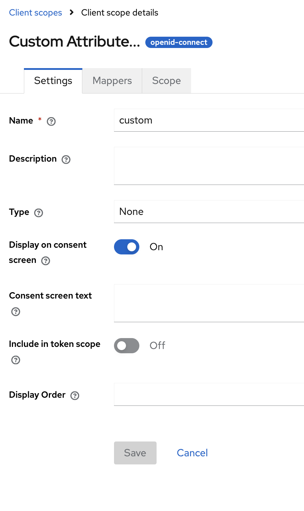
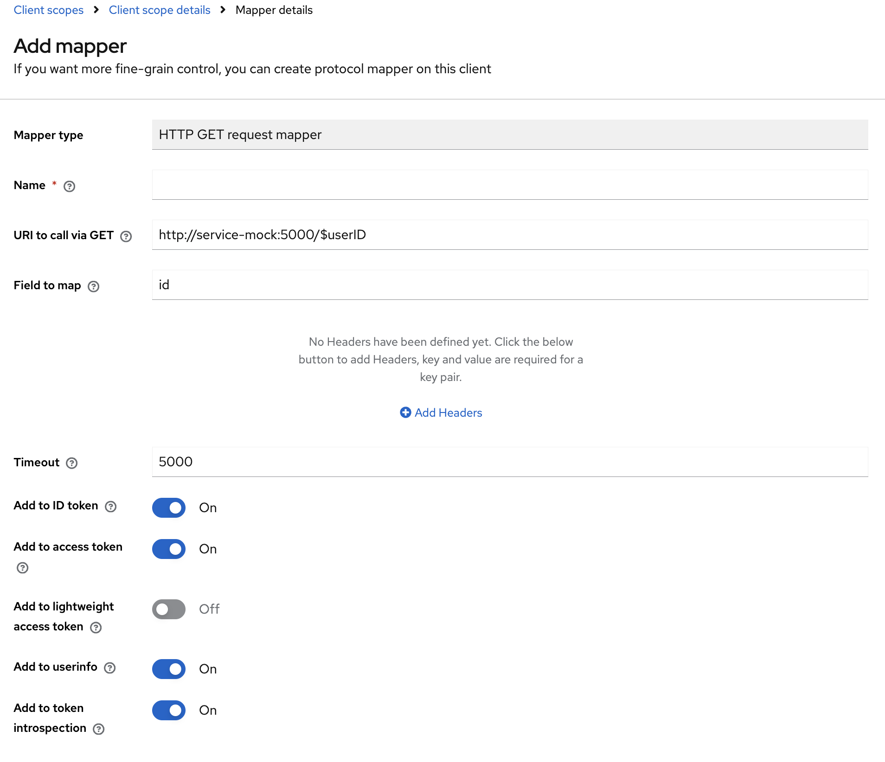

# HTTP GET request mapper

This mapper uses a custom mapper to add a result from an external service (HTTP GET request) to user's tokens.

## Build

This project uses Maven, needs at least JDK 2x1 (openjdk).

The mock service is written in Python with its own docker build.

```
mvn clean install package
docker-compose build
```

## Run

Just run it, it will import all needed data :

```
docker-compose up -d
```

## Usage


Create a custom scope :



with a our custom mapper :




In URI, you can have placeholders :

- $userID : replaces with the user id (sub)
- $userName : replaces with the username
- $userEmail : replaces with the user email

"field to map" extracts the field from the response (json format) and adds it to the token.
