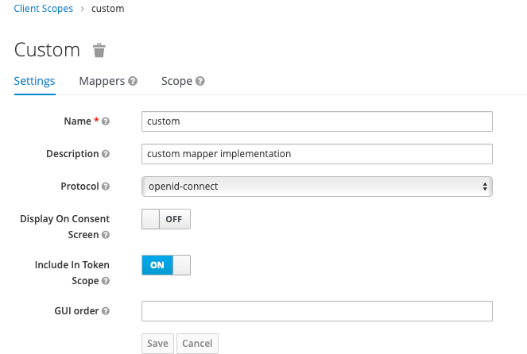
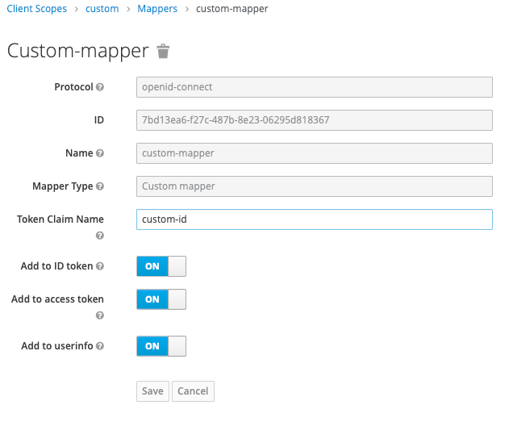
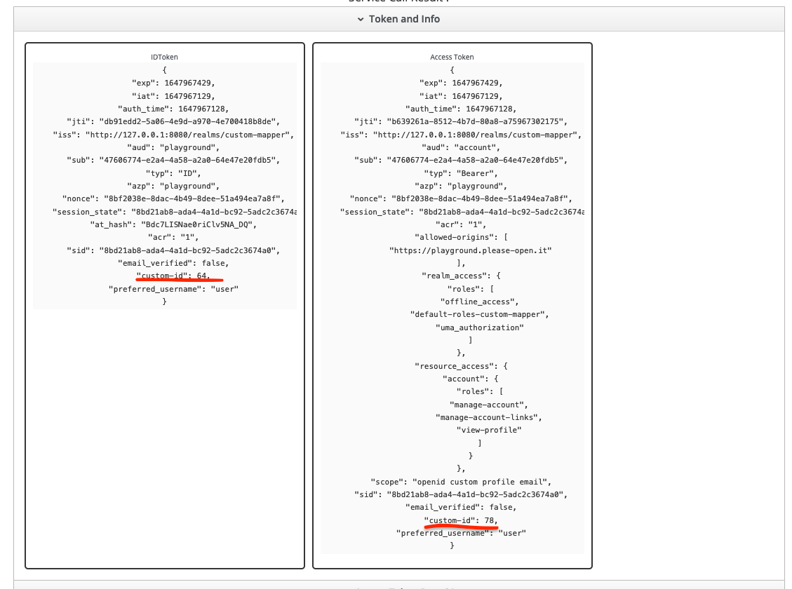

# Custom mapper POC

This prototype uses a custom mapper to add a result from an external service to user's tokens. 

## Build

This project uses Maven, needs at least JDK 11 (openjdk).

The mock service is written in Python with its own docker build.

``` 
mvn clean install package
docker-compose build
```

## Run

Just run it, it will import all needed data : 

```
docker-compose up -d
```

## Usage

Realm "custom-mapper" has what you need.

A custom scope : 



with a our custom mapper : 



## Test

Just open : 
[https://playground.please-open.it?url=http://127.0.0.1:8080&realm=custom-mapper&client=playground&scopes=custom](https://playground.please-open.it?url=http://127.0.0.1:8080&realm=custom-mapper&client=playground&scopes=custom)

The "custom" scope runs the mapper and adds our custom result from the web service in both tokens : 

